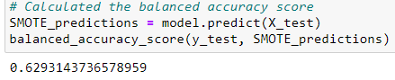
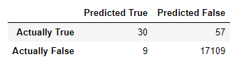

# Credit_Risk_Analysis

## Overview of Project

### Purpose

The purpose of this project was to use different machine learning models to predict credit risk using the credit card dataset from Lending Club, a peer-to-peer lending services company.  From the evaluation of the different models, a written recommendation will be provided on whether any of the models tested is suitable to predict credit risk.

## Results

### Machine Learning Models Tested

A total of 6 machine learning models / algorithms were tested to predict credit risk:
1. Random Over Sampler - an oversampling algorithm
2. Synthetic Minority Oversampling Technique (SMOTE)  - another oversampling algorithm
3. Cluster Centroids - an undersampling algorithm
4. SMOTEENN - A combination of the oversampling SMOTE algorithm and the Edited Nearest Neighboor (ENN) undersampling algorithm
5. Balanced Random Forest Classifier - A bagging algorithm.
6. Easy Ensemble Classifier - A bag of balanced boosted learner algorithms.

### Random Over Sampler

1. The balanced accuracy score calculated using the Random Over Sampler (ROS) algorithm was: 

    A value of 0.515 means that when considering both classes (True Risk and False Risk), the average of the accuracy of prediction for both classes (each class accuracy calculated separately) is 0.515.  If the dataset was balanced (equal number of members of each class), this would mean that 51.5% of the time the model correctly predicted the risk.

2. The "confusion matrix" that shows the matrix of predicted versus actual values calculated using the ROS algorithm is shown below:

    

3. The precision (pre), recall (rec), and F-score (f1) values calculated from the ROS model are shown below:

    A precision score of 0.01 for the high-risk class means that there was a very large number of false positives (6063 out of a total of 6116 predicted to be high risk - taken from confusion matrix), meaning there were many applications for credit that were classified as high risk that were in fact low risk.   

    A precision score of 1.00 for the low risk class means that there were almost no false negatives (34 out of a total of 11089 predicted to be low risk - taken from confusion matrix), inferring that the model predicted correctly all of the credit applicatins that were low risk.  It is hard to believe that the model could be so accurate - suggesting the possibility that the model over-fit.  Should be revisited.

    A recall score of 0.61 for the high-risk class means that there was a significant number of false negatives (34 out of a total of 87 that were actually high risk - taken from confusion matrix), meaning there were many applications for credit that were classifed as being low risk that in fact were high risk.

    A recall score of 0.65 for the low-risk class means that there was a significant number of false positives (6063 out of a total of 17118 that were actually low risk - taken from confusion matrix), meaning there were many applications for credit that were classifed being high risk that in fact were low risk.  

    The low F1 score for the high risk class means that the model had really skewed precision and recall scores, in other words the number of false negatives and false positives predicted was very different.

    The high F1 score for the low risk class means that the model predicts false negative low risk and false positive low risk nearly equally well.

### SMOTE

1. The balanced accuracy score calculated using the SMOTE algorithm was: 

 A value of 0.629 means that when considering both classes (True Risk and False Risk), the average of the accuracy of prediction for both classes (each class accuracy calculated separately) is 0.629.  If the dataset was balanced (equal number of members of each class), this would mean that 62.9% of the time the model correctly predicted the risk.

2. The "confusion matrix" that shows the matrix of predicted versus actual values calculated using the SMOTE algorithm is shown below:

    

3. The precision (pre), recall (rec), and F-score (f1) values calculated from the SMOTE model are shown below:

    A precision score of 0.01 for the high-risk class means that there was a very large number of false positives (6001 out of a total of 6054 predicted to be high risk - taken from confusion matrix), meaning there were many applications for credit that were classified as high risk that were in fact low risk.   

    A precision score of 1.00 for the low risk class means that there were almost no false negatives (34 out of a total of 11151 predicted to be low risk - taken from confusion matrix), inferring that the model predicted correctly all of the credit applicatins that were low risk.  It is hard to believe that the model could be so accurate - suggesting the possibility that the model over-fit.  Should be revisited.

    A recall score of 0.61 for the high-risk class means that there was a significant number of false negatives (34 out of a total of 87 that were actually high risk - taken from confusion matrix), meaning there were many applications for credit that were classifed as being low risk that in fact were high risk.

    A recall score of 0.65 for the low-risk class means that there was a significant number of false positives (6001 out of a total of 17118 that were actually low risk - taken from confusion matrix), meaning there were many applications for credit that were classifed being high risk that in fact were low risk.  

    The low F1 score for the high risk class means that the model had really skewed precision and recall scores, in other words the number of false negatives and false positives predicted was very different.

    The high F1 score (0.79) for the low risk class means that the model predicts false negative low risk and false positive low risk nearly equally well.

### Cluster Centroid

1. The balanced accuracy score calculated using the Cluster Centroid algorithm was: 

    A value of 0.515 means that when considering both classes (True Risk and False Risk), the average of the accuracy of prediction for both classes (each class accuracy calculated separately) is 0.515.  If the dataset was balanced (equal number of members of each class), this would mean that 51.5% of the time the model correctly predicted the risk.

2. The "confusion matrix" that shows the matrix of predicted versus actual values calculated using the Cluster Centroid algorithm is shown below:

    

3. The precision (pre), recall (rec), and F-score (f1) values calculated from the Cluster Centroid model are shown below:

    A precision score of 0.01 for the high-risk class means that there was a very large number of false positives (10114 out of a total of 10168 predicted to be high risk - taken from confusion matrix), meaning there were many applications for credit that were classified as high risk that were in fact low risk.   

    A precision score of 1.00 for the low risk class means that there were almost no false negatives (33 out of a total of 7037 predicted to be low risk - taken from confusion matrix), inferring that the model predicted correctly all of the credit applicatins that were low risk.  It is hard to believe that the model could be so accurate - suggesting the possibility that the model over-fit.  Should be revisited.

    A recall score of 0.62 for the high-risk class means that there was a significant number of false negatives (33 out of a total of 87 that were actually high risk - taken from confusion matrix), meaning there were many applications for credit that were classifed as being low risk that in fact were high risk.

    A recall score of 0.41 for the low-risk class means that there was a significant number of false positives (10114 out of a total of 17118 that were actually low risk - taken from confusion matrix), meaning there were many applications for credit that were classifed being high risk that in fact were low risk.  

    The low F1 score for the high risk class means that the model had really skewed precision and recall scores, in other words the number of false negatives and false positives predicted was very different.

    The average F1 score (0.58) for the low risk class means that the model predicts false negative low risk and false positive low risk with different accuracy.

### SMOTEEN

1. The balanced accuracy score calculated using the SMOTEEN algorithm is shown below:

    A value of 0.677 means that when considering both classes (True Risk and False Risk), the average of the accuracy of prediction for both classes (each class accuracy calculated separately) is 0.677.  If the dataset was balanced (equal number of members of each class), this would mean that 67.7% of the time the model correctly predicted the risk.

2. The "confusion matrix" that shows the matrix of predicted versus actual values calculated using the SMOTEEN algorithm is shown below:

    

3. The precision (pre), recall (rec), and F-score (f1) values calculated from the SMOTEEN model are shown below:

      A precision score of 0.01 for the high-risk class means that there was a very large number of false positives (6730 out of a total of 6795 predicted to be high risk - taken from confusion matrix), meaning there were many applications for credit that were classified as high risk that were in fact low risk.   

    A precision score of 1.00 for the low risk class means that there were almost no false negatives (22 out of a total of 10410 predicted to be low risk - taken from confusion matrix), inferring that the model predicted correctly all of the credit applicatins that were low risk.  It is hard to believe that the model could be so accurate - suggesting the possibility that the model over-fit.  Should be revisited.

    A recall score of 0.75 for the high-risk class means that there was a significant number of false negatives (22 out of a total of 87 that were actually high risk - taken from confusion matrix), meaning there were many applications for credit that were classifed as being low risk that in fact were high risk.

    A recall score of 0.61 for the low-risk class means that there was a significant number of false positives (6730 out of a total of 17118 that were actually low risk - taken from confusion matrix), meaning there were many applications for credit that were classifed being high risk that in fact were low risk.  

    The low F1 score for the high risk class means that the model had really skewed precision and recall scores, in other words the number of false negatives and false positives predicted was very different.

    The average F1 score (0.58) for the low risk class means that the model predicts false negative low risk and false positive low risk with different accuracy.

### Balanced Random Forest Classifier 

1. The balanced accuracy score calculated using the Balanced Random Forest Classifier (BRFC) algorithm was: 

A value of 0.677 means that when considering both classes (True Risk and False Risk), the average of the accuracy of prediction for both classes (each class accuracy calculated separately) is 0.672.  If the dataset was balanced (equal number of members of each class), this would mean that 67.2% of the time the model correctly predicted the risk.

2. The "confusion matrix" that shows the matrix of predicted versus actual values calculated using the BRFC algorithm is shown below:

    

3. The precision (pre), recall (rec), and F-score (f1) values calculated from the BRFC model are shown below:

      A precision score of 0.77 for the high-risk class means that there was a small number of false positives (9 out of a total of 39 predicted to be high risk - taken from confusion matrix), meaning there were few applications for credit that were classified as high risk that were in fact low risk.   

    A precision score of 1.00 for the low risk class means that there were almost no false negatives (57 out of a total of 17166 predicted to be low risk - taken from confusion matrix), inferring that the model predicted correctly all of the credit applicatins that were low risk.  It is hard to believe that the model could be so accurate - suggesting the possibility that the model over-fit.  Should be revisited.

    A recall score of 0.34 for the high-risk class means that there was a significant number of false negatives (57 out of a total of 87 that were actually high risk - taken from confusion matrix), meaning there were few applications for credit that were classifed as being low risk that in fact were high risk.

    A recall score of 1.0 for the low-risk class means that there were almost no false positives (9 out of a total of 17118 that were actually low risk - taken from confusion matrix), meaning there were almost no applications for credit that were classifed being high risk that in fact were low risk.  In other words the model correctly identified all the credit applications that were high risk.  It is hard to believe that the model could be so accurate - suggesting the possibility that the model over-fit.  Should be revisited.

    The average F1 score for the high risk class means that the model had different precision and recall scores, in other words the number of false negatives and false positives predicted is different.

    The maximum F1 score (1) for the low risk class means that the model predicts false negative low risk and false positive low risk with high and equal accuracy.

### Easy Ensemble Classifier

1. The balanced accuracy score calculated using the Easy Ensemble Classifier (EEC) algorithm was: 

    A value of 0.925 means that when considering both classes (True Risk and False Risk), the average of the accuracy of prediction for both classes (each class accuracy calculated separately) is 0.925.  If the dataset was balanced (equal number of members of each class), this would mean that 92.5% of the time the model correctly predicted the risk (low and high)

2. The "confusion matrix" that shows the matrix of predicted versus actual values calculated using the EEC algorithm is shown below:

    

3. The precision (pre), recall (rec), and F-score (f1) values calculated from the EEC model are shown below:

      A precision score of 0.07 for the high-risk class means that there was a very large number of false positives (992 out of a total of 1071 predicted to be high risk - taken from confusion matrix), meaning there were many applications for credit that were classified as high risk that were in fact low risk.   

    A precision score of 1.00 for the low risk class means that there were almost no false negatives (8 out of a total of 16134 predicted to be low risk - taken from confusion matrix), inferring that the model predicted correctly all of the credit applicatins that were low risk.  It is hard to believe that the model could be so accurate - suggesting the possibility that the model over-fit.  Should be revisited.

    A recall score of 0.91 for the high-risk class means that there was a small number of false negatives (8 out of a total of 87 that were actually high risk - taken from confusion matrix), meaning there were many applications for credit that were classifed as being low risk that in fact were high risk.

    A recall score of 0.94 for the low-risk class means that there were a small number of false positives (992 out of a total of 17118 that were actually low risk - taken from confusion matrix), meaning there were almost no applications for credit that were classifed being high risk that in fact were low risk.  In other words the model correctly identified all the credit applications that were high risk.  It is hard to believe that the model could be so accurate - suggesting the possibility that the model over-fit.  Should be revisited.

    The average F1 score for the high risk class means that the model had different precision and recall scores, in other words the number of false negatives and false positives predicted is different.

    The maximum F1 score (1) for the low risk class means that the model predicts false negative low risk and false positive low risk with equal accuracy.

## Summary

### Model Comparison

The models varied widely in their precision and recall metrics to determine high risk credit card applications as well as their recall metric to determine low risk credit.

Almost all models did well in terms of the precision to determine low risk credit, meaning that there were almost no applications that were predicted to be low risk that were indeed high risk.  

Of all the models tested, the Easy Ensemble Classifier model has the highest balanced accuracy score (0.925).  The model with the second highest score is the Balanced Random Forest Classifier with a score of 0.77.  All other models tested have scores lower than 0.68.  This means that the Easy Emsemble Classifier model is the most accurate to predict applications that are high risk and low risk.

One important parameter in which the models differ is in their precision metric to determine high risk loans.  This is important because the lower the precision metric is the higher the number of loan applications that are incorrectly labelled as high risk.  This could be a problem if it means that the bank refuses to lend credit to these applications.  Comparing this metric across all models, the only model that does well is the Balanced Random Forest Classifier where only 9 credit applications that were incorrectly predicted as high risk.  

### Model Recommendation

Given that all the models are presumably equally able (assuming that overfitting was not an issue) to not make the mistake of identifying a high risk credit application as a low risk, which could result in significant losses for the bank, the next parameter that is of importance is to correctly identify only the high risk applications as being high risk.  In these terms, the best model is the Balanced Random Forest Classifier.  In my opinion, even though this model is not perfect, the Balanced Random Forest Classifer is therefore an acceptable model in minimizing possible large losses due to defaulted loans and ensuring that the majority of low risk applications are predicted as such and the loans given out.

